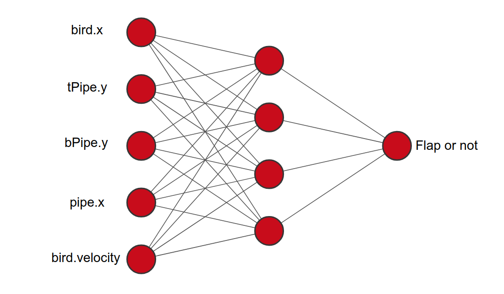

# Learning bird ([Demo](https://khanhnb.github.io/learning-bird/demo/))

  

A naive bird that learns how to flap by NeuroEvolution.

  

  

## NeuroEvolution

  

Neuroevolution, or neuro-evolution, is a form of artificial intelligence that uses evolutionary algorithms to generate artificial neural networks (ANN), parameters, topology and rules. [More info](https://en.wikipedia.org/wiki/Neuroevolution).

  

  

## Algorithms

  

### Neural Network

  

* A fully-connected [feedforward](https://en.wikipedia.org/wiki/Feedforward_neural_network) neural network with one hidden layer [5 4 1].

  

* Inputs:

* y position of a bird.

* y position of nearest top pipe.

* y position of nearest bottom pipe.

* x position of neaset pipe.

* Velocity of a bird.

* Output:

* `output > 0.5` then `bird.flap()`.

### Genetic Algorithm

**Step 1**: Create a population.

**Step 2**: LOOP

* Evaluate the fitness of birds' brains (aka neural networks)

* Create a new generation.

* Pick parents based on their fitness score to breed.

	* Crossover

	* Mutation

Here are parameters used in the demo:
*	Population: 100
*	Elitism: 0.2 (best birds are kept unchanged for the next generation)
*	New random birds: 0.2
*	Mutation rate: 0.2
*	Mutation range: 0.5
